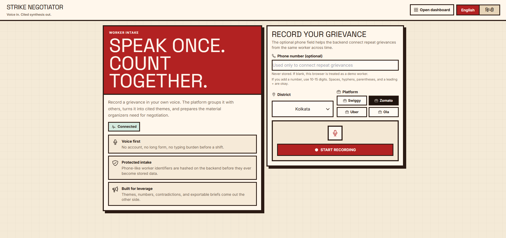
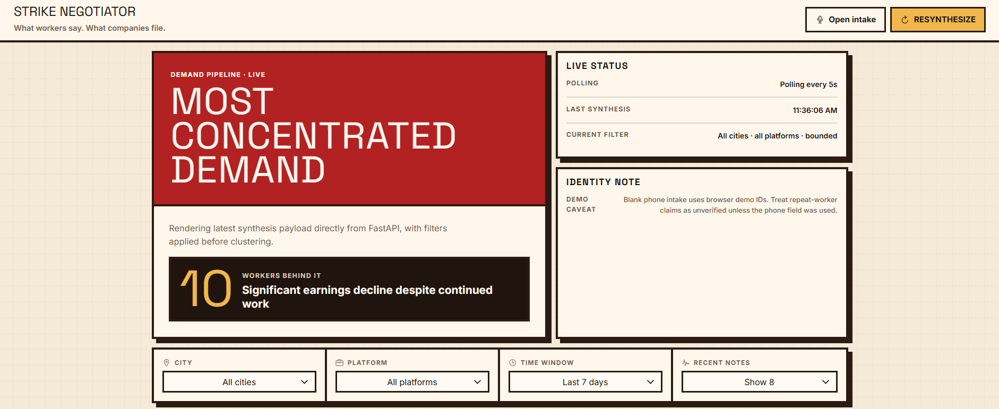
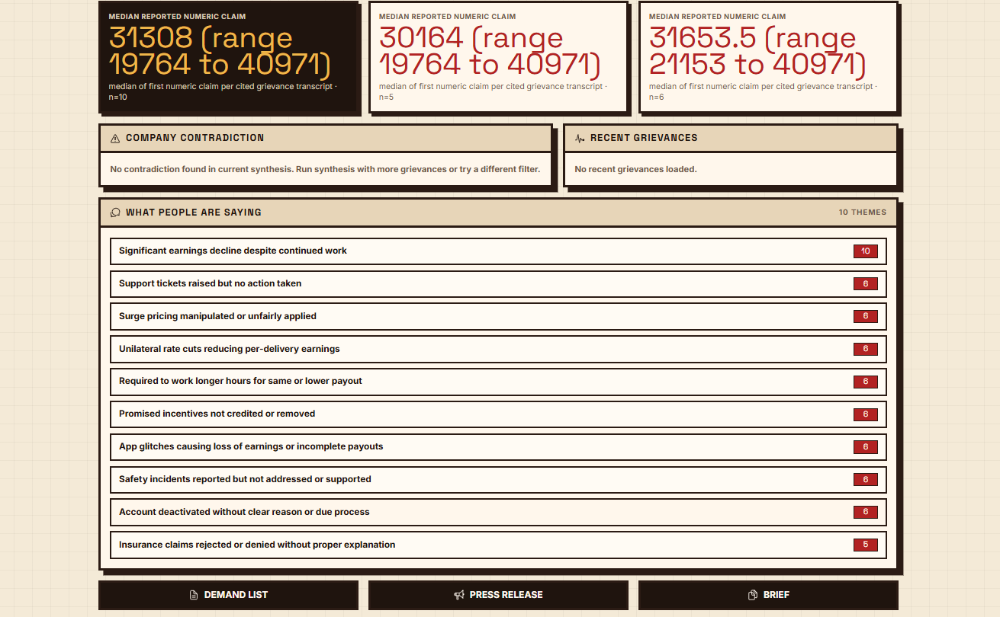

# Strike Negotiator

**Voice in. Cited synthesis out.**

Strike Negotiator is an open-source platform for gig-worker labor organizing. Workers submit grievances by voice in any language; the platform transcribes, clusters, and quantifies them — then cross-references the results against company filings to surface contradictions organizers can use at the negotiation table.

---

## Why it exists

Union researchers spend days manually aggregating worker complaints, hunting through regulatory filings, and drafting demand documents. Strike Negotiator collapses that into minutes by running a four-stage AI pipeline over the raw voice data and producing fully cited outputs: demand lists, press releases, and negotiation briefs with grievance IDs attached to every claim.

---

## Features

- **Voice-first intake** — workers record a grievance in any language; Whisper transcribes and translates automatically
- **Four-stage synthesis pipeline** — cluster → quantify → cross-reference → draft, each stage with a deterministic local fallback
- **Filing cross-reference** — worker metrics compared against ingested DRHP, annual report, and investor call excerpts to detect contradictions
- **Citation integrity** — every metric and theme carries the grievance IDs it was derived from; an n-count guard drops any metric where the count and the ID list disagree
- **Bilingual UI** — English and Hindi, switchable per session
- **Exportable outputs** — demand list, press release, and negotiation brief as markdown, downloadable from the dashboard
- **Privacy-preserving** — worker phone numbers are hashed before storage; audio is never persisted beyond transcription
- **Offline-capable** — all four pipeline stages have local fallbacks; the entire system runs without an Anthropic API key

---

## Architecture

```
                    ┌─────────────────┐
                    │   Worker intake │  form.html
                    │  (voice / text) │
                    └────────┬────────┘
                             │ POST /ingest
                    ┌────────▼────────┐
                    │  Local Whisper  │  3-pass: detect → transcribe → translate
                    │  transcription  │
                    └────────┬────────┘
                             │
                    ┌────────▼────────┐
                    │    SQLite DB    │  grievance · filing_chunk · synthesis · export
                    └────────┬────────┘
                             │ POST /syntheses
              ┌──────────────▼──────────────┐
              │     Four-stage pipeline     │
              │  1. Cluster   (Claude / KW) │
              │  2. Quantify  (Claude / re) │
              │  3. Cross-ref (Claude / KW) │
              │  4. Draft     (Claude / tpl)│
              └──────────────┬──────────────┘
                             │
                    ┌────────▼────────┐
                    │    Dashboard    │  dashboard.html · 5s polling
                    │ themes·metrics  │
                    │ contradictions  │
                    │ export buttons  │
                    └─────────────────┘
```

---

## Stack

| Layer | Technology |
|---|---|
| Backend | FastAPI + SQLite (SQLAlchemy, zero migrations) |
| Transcription | `openai-whisper` (local, ffmpeg required) |
| AI pipeline | Anthropic Claude (`claude-3-5-sonnet-latest`) with local fallbacks |
| Frontend | Vanilla JS · Tailwind CSS CDN · Ionicons |
| Fonts | Space Grotesk · Inter (Google Fonts) |

---

## Getting started

### Prerequisites

- Python 3.11+
- [ffmpeg](https://ffmpeg.org/) on PATH — required by Whisper for audio decoding

```bash
# macOS
brew install ffmpeg

# Windows
winget install ffmpeg

# Ubuntu / Debian
apt install ffmpeg
```

### Install

```bash
git clone https://github.com/kabyik-kayal/strike-negotiator
cd strike-negotiator
python -m venv .venv && source .venv/bin/activate  # Windows: .venv\Scripts\activate
pip install -r requirements.txt
```

### Configure

```bash
cp .env.example .env
```

| Variable | Required | Description |
|---|---|---|
| `STRIKE_HASH_SALT` | **Yes** | Secret used to hash worker identifiers before storage |
| `ANTHROPIC_API_KEY` | Yes (Optional) | Enables Claude-backed synthesis. All stages fall back to local heuristics without it. |
| `STRIKE_ANTHROPIC_MODEL` | No | Override the Claude model (default: `claude-3-5-sonnet-latest`) |
| `STRIKE_LOCAL_WHISPER_MODEL` | No | Whisper model size (default: `base`; `small` or `medium` for better accuracy) |

### Run

```bash
uvicorn server.main:app --reload
```

The Whisper model pre-warms at startup. The first boot will download the model (~145 MB) if it is not already cached.

- Intake form: `http://localhost:8000`
- Dashboard: `http://localhost:8000/dashboard`
- API docs: `http://localhost:8000/docs`

---

## UI/VISUALS







## Seed data

Run these in order with the server running:

```bash
# Load filing chunks (Swiggy DRHP, Zomato annual report, Zomato investor call)
python -m seed.load_filings

# Seed targeted grievances designed to surface contradictions
python -m seed.seed_targeted_grievances

# Generate broad synthetic grievances across cities, platforms, languages, and complaint types
python -m seed.generate --offline     # no API key required
python -m seed.generate               # Claude-backed, richer output
```

## API reference

| Method | Path | Description |
|---|---|---|
| `GET` | `/` | Worker intake form |
| `GET` | `/dashboard` | Organizer dashboard |
| `GET` | `/health` | Health check |
| `GET` | `/metadata` | City and platform option lists |
| `GET` | `/dashboard/state` | Full dashboard payload — accepts `city`, `platform`, `since`, `recent_limit` |
| `POST` | `/ingest/text` | Submit a text grievance |
| `POST` | `/ingest` | Upload and transcribe an audio grievance |
| `GET` | `/grievances` | List grievances |
| `GET` | `/grievances/{id}` | Get one grievance |
| `POST` | `/filing-chunks` | Ingest a filing chunk |
| `GET` | `/filing-chunks` | List filing chunks |
| `POST` | `/syntheses` | Run synthesis for a scope (`city`, `platform`, `since`) |
| `GET` | `/syntheses/latest` | Get the most recent synthesis |
| `GET` | `/syntheses/{id}` | Get one synthesis |
| `POST` | `/exports` | Generate or retrieve a markdown export |
| `GET` | `/exports/{id}` | Get one export |

---

## Project layout

```
server/
  main.py                   Routes and FastAPI app
  models.py                 SQLAlchemy models
  ingest.py                 Audio upload handler, worker secret hashing
  transcribe.py             Local Whisper (detect → transcribe → translate)
  synthesize.py             Four-stage pipeline with local fallbacks
  claude.py                 Anthropic SDK wrapper, structured output enforcement
  prompts/                  cluster.md  quantify.md  crossref.md  draft.md

frontend/
  form.html                 Worker intake (recording, city/platform, EN/HI)
  dashboard.html            Organizer dashboard (themes, metrics, contradiction, exports)
  shared.css                Design tokens and shared component styles
  utils.js                  escapeHtml, relativeTime

seed/
  generate.py               Synthetic grievance generator
  load_filings.py           Chunks and loads source filings into the database
  seed_targeted_grievances.py   Contradiction-targeted grievance seeder
  converter.py              PDF to plain-text converter
  filings/raw/              Source PDFs
  filings/text/             Plain-text conversions

docs/
  architecture.md           System design and data model
  demo-script.md            Walkthrough script

tests/
  test_pipeline.py          End-to-end synthesis contract (offline)
  test_citations.py         Citation integrity — IDs exist, n-counts match
```

---

## Tests

```bash
pytest -q
```

Both suites run fully offline — no API key required.

## License

[MIT](LICENSE)
